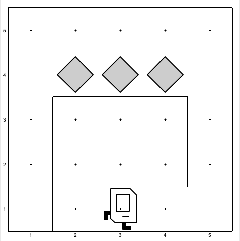
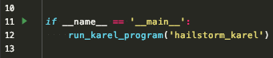
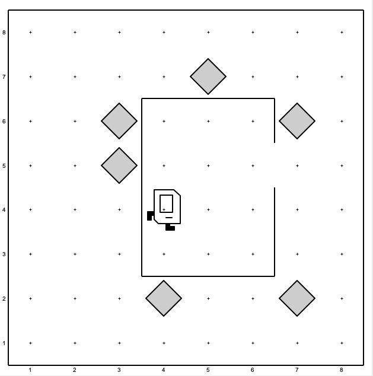
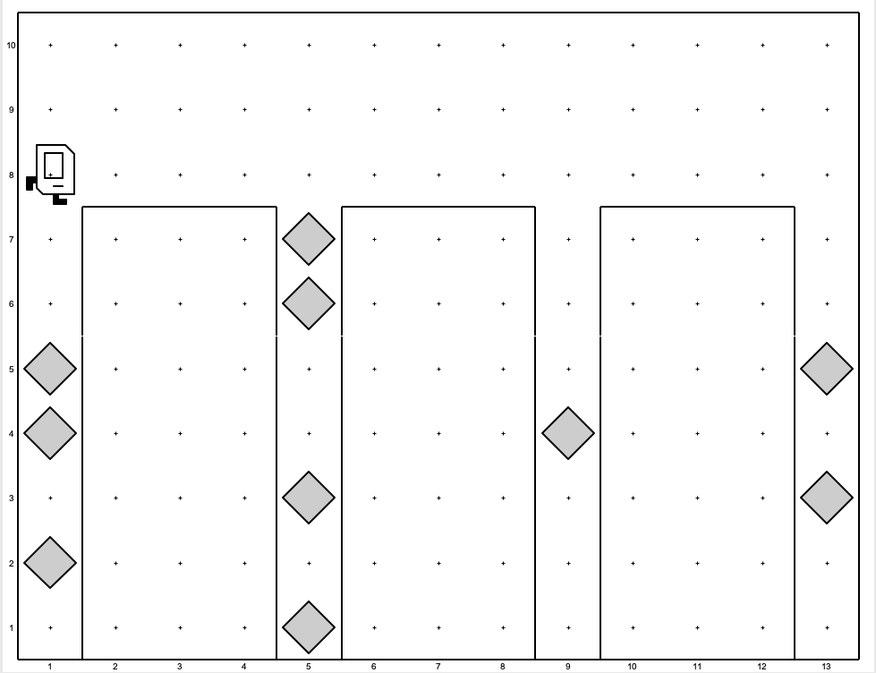
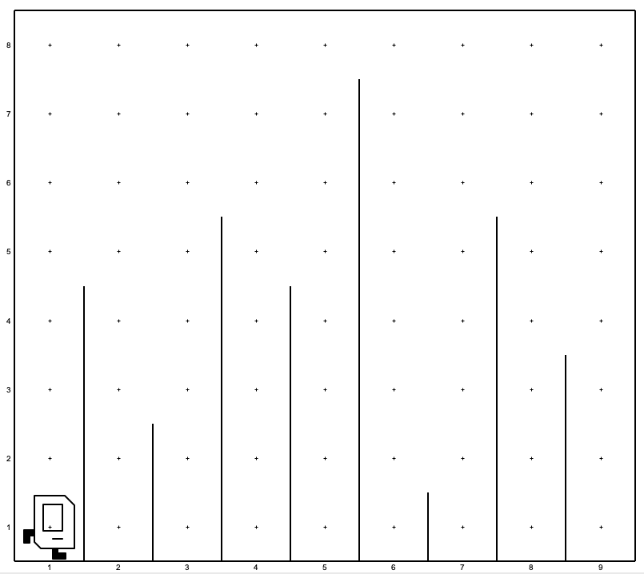
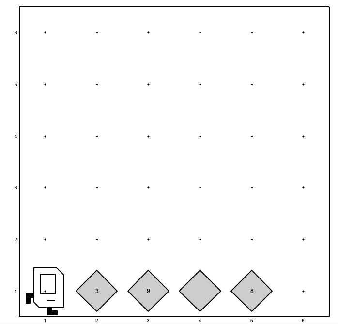
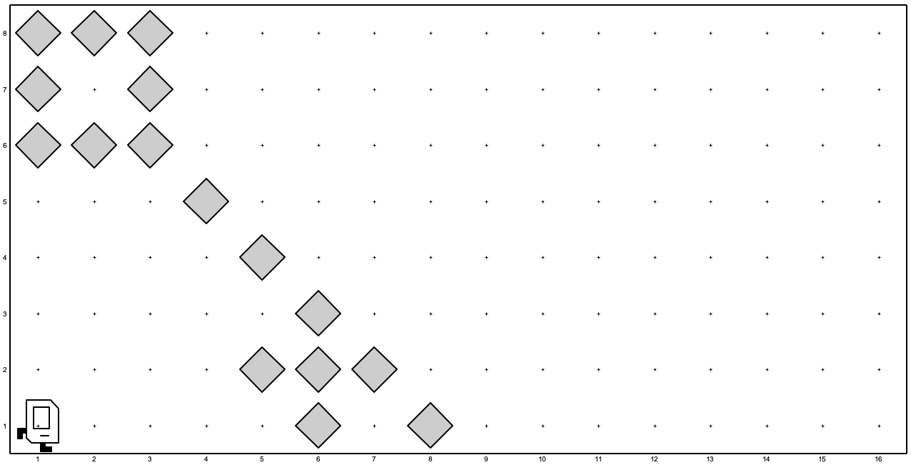

assign0: Karel the Robot
========================

.. contents:: :local:

Background for ``assign0``
~~~~~~~~~~~~~~~~~~~~~~~~~~

Karel the Robot is a framework for learning *control flow*, which is at the
core of understanding computer programming, regardless of the language you
are writing in.

Karel was developed at Stanford University for use in the first assignment of
the introductory computer science class,
`CS106A <http://web.stanford.edu/class/cs106a/>`_. We are going to be using
Karel for the very first assignment as well, with slightly different problems
than what CS106A uses for their Karel problems.

The course staff for CS106A is aware of ``zero-to-ai`` as well as our use of
Karel for the first assignment here. As such, they have explicitly asked us to
not use the Karel problems from CS106A, in the interest of helping prevent
honor code violations that the CS106A staff has to fight ever quarter they
teach the class. Inevitably, solutions to the actual CS106A problems end up
online, and we don't want to be another source of solutions to the course
assignments.

Therefore, I've written my own Karel problems that mirror the algorithmic
difficulty of the CS106A problems, but are different on their own.

That said, we are going to use the CS106A course reader and documentation
for Karel. The only difference will be the actual Karel problems that
comprise this assignment.

Karel Course Reader
~~~~~~~~~~~~~~~~~~~

`Here <https://compedu.stanford.edu/karel-reader/docs/python/en/intro.html>`_
is the Karel Python course reader for CS106A. Follow this at your own pace:
it should take about an hour or two to read and digest. Once you've done this,
you're ready to start coding solutions to the Karel problems here! Keep the
course reader as a reference while you write up your solutions.

Creating your Assignment Branch
~~~~~~~~~~~~~~~~~~~~~~~~~~~~~~~

Switch to the ``zero-to-ai`` directory

.. code-block:: bash

    cd ~/sandbox/zero-to-ai

Make sure you have no local changes. Issue

.. code-block:: bash

    git status

and verify that you have no local changes to the code base (local changes are
any edits to contents in the ``zero-to-ai`` directory that haven't been
committed yet).

Pull the ``master`` branch (the latest copy of the code that is on ``master``):

.. code-block:: bash

    git pull

You likely have the latest copy of the code base from the remote ``master``
branch, but if not, this will pull any changes to your local copy of ``master``.

Next, you are going to create your ``assign0`` submission branch which you will
write your solutions on. Issue:

.. code-block:: bash

    git checkout -b '<github_username>/assign0/<short_message>'

As an example,

.. code-block:: bash

    git checkout -b 'jcranston/assign0/assignment-implementation'

This will switch you to a branch of the ``zero-to-ai`` code base that is a
snapshot of the code base that you created it from (so right now, it is just
a mirror reflection of what is on master).

It is important to name your feature branch in the style as above, so it can
be detected by the autograder when you submit your code by pushing to the
remote (see instructions at the end of this page for how to submit). The
``<short_message>`` can be different, but please keep the
``<github_username>/assign0`` format so the autograder can know to run tests
against ``assign0`` and associate a submission with your Github account.

When you start committing changes to your feature branch for ``assign0``, these
commits will only be on your branch and not on the ``master`` branch.

Now, issue

.. code-block:: bash

    git branch

and verify that you see both ``master`` and your feature branch you just
created.

Assignment Code
~~~~~~~~~~~~~~~

You will be editing a number of the the ``*.py`` files in the
``python/zero2ai/assign0`` directory of the source code (feel free to explore
these files in PyCharm now). The notation ``*.py`` stands for "all files or
directories that match the name pattern of any or no series of characters
followed by the characters ``.py`` at the end.

Do not worry about editing any other files in the project structure: other
files and directories are needed for running the Karel assignment as well as
the tests. You can feel free to explore these files but please only edit the
Python files defined below for the assignment.

You can do the following Karel problems in any order, but please only work on
one Karel problem at a time so that you can commit your changes for each
problem in separate commits. I recommend following the order specified in this
document as the problems increase in difficulty.

Finally, please only use the API offered by the ``stanfordkarel`` library
for this assignment. Refrain from using any features of the Python language
other than what is afforded by ``stanfordkarel`` from the course reader. The
goal with ``assign0`` is to learn to think algorithmically with a finite set
of tools. If you have knowledge of the Python programming language already,
using those features makes solving Karel problems a lot less fun and less of
a learning experience. We'll get to learning the full Python language in the
next two assignments :)

Karel is guaranteed to have an infinite number of beepers in its bag for
every problem in ``assign0``.

Testing your Code
~~~~~~~~~~~~~~~~~

As you progress through the problems below, you can test your solutions to
make sure they pass correctly between how your code executes and what the
expected output is. To run tests, first switch to the ``python`` directory
within the project, then issue:

.. code-block:: bash

    make test-assign0

Run the tests now to familiarize yourself with the test execution before
writing any code. Take some time to familiarize yourself with the test output
as well. As expected, all the tests fail because you have not implemented the
assignment yet. Use this test framework to verify that your Karel algorithms
work as expected. Use this test ``make`` target to verify that you have
completed an individual Karel problem before moving onto the next Karel
problem.

When you submit your code (push your branch to the remote repository in
Github), a full battery of tests will run that are more robust than the test
target you have access to here, so make sure your code is robust as per the
assignment specification.

Hailstorm Karel
~~~~~~~~~~~~~~~

File: ``hailstorm_karel.py``

Make sure you have no local changes before beginning the problem by issuing
a ``git status`` from anywhere within the ``zero-to-ai`` directory. This
should be true when you are beginning each of the Karel problems here.

It just hailed and Karel needs to go remove the hailstones from the roof of its
house! Your job is to write a Karel program where Karel removes the hailstones
(beepers) from the roof and then returns to its starting location.

Karel starts at the 1st row and 3rd column facing east. Karel must remove the
hailstone beepers on the roof of its house and return to its starting point at
1st row and 3rd column facing east.

The source code currently looks like the following:

.. code-block:: python
    :linenos:

    # from stanfordkarel import *
    # todo: uncomment above and delete the line below when you start coding!
    from stanfordkarel import run_karel_program

    def main():
        # todo replace with your code!
        pass

    if __name__ == '__main__':
        run_karel_program('hailstorm_karel')

The boilerplate code in lines 1 through 3 ask you to remove line 3 and
uncomment line 1. To help you get started, you should modify the top of the
file to look like this:

.. code-block:: python
    :linenos:

    from stanfordkarel import *

Repeat this process for each other boilerplate file in ``assign0``.

You will replace the comments and the ``pass`` statement in the ``main``
method with your assignment code. Make sure to write methods that reflect the
concept of
`decomposition <https://compedu.stanford.edu/karel-reader/docs/python/en/chapter4.html>`_
in the Karel course reader. Refer to the Karel course reader for instructions
on how to make Karel perform its duties!

To run your Karel program in the graphical interface, you can either switch to
the ``python/zero2ai/assign0`` directory and run

.. code-block:: bash

    python hailstorm_karel.py

which will open up the visual for the program that you can interact with, or
you can run the graphical interface by clicking on the green arrow in PyCharm
next to the ``if __name__ == '__main__':`` line:

When you think you are finished with hailstorm Karel, ensure the ``make docs``
target described above passes for the hailstone Karel problem. Once it does and
you are satisfied with your code begin the process of committing. From the
``~/sandbox/zero-to-ai`` (this does not matter as long as you are within the
``zero-to-ai`` project, but for consistency with the output here in the
documentation), issue:

.. code-block:: bash

    git status

You should see that ``git status`` is reporting that you have modified the
file you were working on. If you want, you can view the changes with
``git diff`` (Hit the ``Q`` key to quit the ``git diff`` view). Now, stage
your code for a commit using ``git add`` as follows:

.. code-block:: bash

    git add python/zero2ai/assign0/hailstorm_karel.py

Finally, issue a ``git commit`` with a message similar to the following:

.. code-block:: bash

    git commit -m 'implemented and successfully tested hailstone karel'

Once you issue this, you can issue a ``git log`` to see your most recent
commit on your feature branch! (Hit the ``Q`` key to quit the ``git log``
view).

Lawn Mowing Karel
~~~~~~~~~~~~~~~~~

File: ``lawn_mowing_karel.py``

Karel has beeper weeds growing around its house and needs to move the lawn
(pick the beepers up).

Karel starts at 4th row and 4th column, facing east. Karel's door is
guaranteed to be two columns over and one row up, but the dimensions of
Karel's house are not guaranteed to always be what they are in this example
(the house will always be a rectangle and the door will always be in the
same location, but the sides of the rectangle can vary). Beepers will only
ever be next to the side of Karel's house, and there will be at most one
beeper per corner. Beepers will never appear elsewhere in the world.

Karel must leave its house, mow its lawn (pick up the beepers), and return to
its starting point at 4th row and 4th column, facing east.

Make sure to test your code when you believe you are finished, and commit
your changes to your local git branch (see the hailstorm Karel problem for
the specific git commands to issue, and modify your commit message
accordingly).

Restoration Karel
~~~~~~~~~~~~~~~~~

File: ``restoration_karel.py``

Karel is called to the rescue after the evil excavation company mined for all
the silicon in the ground and did not fill the holes back up. Karel needs to
fill the holes from the excavation company with dirt (beepers) in an act of
proud environmental conservancy!

Karel begins on 8th row and 1st column, facing east. Karel must fill each hole
with beepers, placing dirt (beepers) where necessary, and not placing dirt
(a beeper) if there exists one already.

Holes are guaranteed to be every 4 columns, so 1st column, 5th, column,
9th column, etc. There may be a varying number of holes in Karel's world,
and holes can go down to an arbitrary depth. Holes can contain an arbitrary
number of dirt (beepers), or none at all. There will be no dirt anywhere else
in the world. Karel needs to place at most one dirt (beeper) on a missing
corner.

Karel must finish on 8th row facing east at the easternmost part of the grid.
There may or may not be a hole on the last column of the grid.

Make sure to test your code and then commit your changes.

Steeplechase Karel
~~~~~~~~~~~~~~~~~~

File: ``steeplechase_karel.py``

Karel is training for the robot Olympics and will be competing in the
steeplechase event. For this task, Karel needs to jump a series of
steeplchase hurdles, placing a beeper at the bottom of each hurdle, including
at the first and last columns of the world.

Karel begins on 1st row and 1st column facing east. Hurdles (walls) are
guaranteed to exist between every column of the world. Hurdles can be any
height of at least one wall tall.

Karel must finish on 1st row facing east on top of the last beeper it placed
on the easternmost column (this is not guaranteed to be nine columns wide). The
difficulty in this assignment will be figuring out the stop condition for
Karel to stop jumping hurdles. It is up to you to coach Karel to win!

Make sure to test your code and then commit your changes.

Double Beeper Karel
~~~~~~~~~~~~~~~~~~~

File: ``double_beeper_karel.py``

Karel wants to learn a "get rich quick" investing scheme that can double its
portfolio value! Karel is presented with a series of beeper piles in a row
and must double the count of beepers in each pile.

Karel starts at 1st row and 1st column, facing east. Karel is guaranteed to
start on a corner with no beepers, and Karel is guaranteed to experience a
nonzero sequence of columns with beepers on 1st row. As soon as Karel reaches
a column without a beeper on it, Karel is guaranteed to also be at the
easternmost part of the world. Karel must end on the easternmost part of the
world on 1st row, facing east.

In the process, Karel must also double the count of the beepers in each pile
Karel comes across. Karel's world is guaranteed to have the same number of
rows as columns (so it is a square). Karel can move anywhere in the world and
place beepers anywhere, so long as all extra beepers are cleaned up except
for the ones needing to be doubled. Initially, beepers will appear in no
other location except where previously described.

Remember, you cannot use Python language features except what is available in
the Karel course reader. This is a bit of a tricky problem, but fun
nonetheless!

Make sure to test your code and then commit your changes.

Duplication Karel
~~~~~~~~~~~~~~~~~

File: ``duplication_karel.py``

Karel is forgetful and needs to make a copy of the key to its house. In
general, Karel has an "image" of beepers (at most 1 beeper per corner) in the
leftmost 8 by 8 part of the world. Karel must duplicate this image of beepers
in the rightmost 8 by 8 part of the world.

The world is guaranteed to be eight 8 rows tall and 16 columns wide. There will
initially be no beepers at or past column 9, and there can be any number of
beepers between columns 1 through 8 (with at most 1 per corner). Regardless of
the image in the first 8 columns, this must be duplicated in the last 8
columns. Meaning if there is a beeper at row 5 and column 7, Karel must place
a beeper at row 5 and column 15.

Karel must finish on 1st row and 1st column, facing east.

Make sure to test your code and then commit your changes.

Submitting ``assign0``
~~~~~~~~~~~~~~~~~~~~~~

You should have six commits on your local branch for ``assign0``. Issue a
``git log`` to see all your commits. These commits are helpful for a grader
of your assignment to see your incremental progress when they are looking at
your code, and it also helps you learn the workflow with git and version
control.

In the ``zero-to-ai/python`` directory, ensure all tests pass:

.. code-block:: bash

    make test-assign0

Fix any errors you might have and commit your changes accordingly with an
appropriate commit message. Ideally, you will not have errors if you
developed this assignment incrementally.

Now, you will run the linter:

.. code-block:: bash

    make lint

The linter runs both `flake8 <https://pypi.org/project/flake8/>`_ and
`pylint <https://pypi.org/project/pylint/>`_ targets, reporting Python style
errors you might have. You will likely spend some time correcting errors
that the linter reports, and have to repeatedly issue ``make lint`` until you
fix all errors. When all tests pass for ``assign0`` and you fixed all errors
reported from the linter, issue a

.. code-block:: bash

    make clean

to clean any extraneous files in the project, and next issue a final commit
indicating you are ready for submission:

.. code-block:: bash

    cd ~/sandbox/zero-to-ai && git commit -am 'ready to submit assign0'

Now you are ready to push your feature branch to the remote (Github) repo:

.. code-block:: bash

    git push -u origin <your_feature_branch_name>

This will kick off the series of autograder tests which will run your Karel
code against an even more robust suite of tests on different world variations.
You will receive an email report once your autograder completes, and I will get
notified of your submission.

Feedback for ``assign0``
~~~~~~~~~~~~~~~~~~~~~~~~

I will use the report from the autograder (initiated by the ``git push``
command just described) as well as inspect your submission on the remote
branch, and leave comments in Github for you to look at. I will leave
constructive criticism on your code in Github for you to read and learn from:
this is perhaps the most valuable learning opportunity in ``zero-to-ai``. Next,
you can make local changes on your feature branch, adopting the feedback I
gave on Github, and create a new commit and push to the remote branch again.
This will kick off the autograder once more. We can repeat this cycle as much
as you would like to receive feedback.
